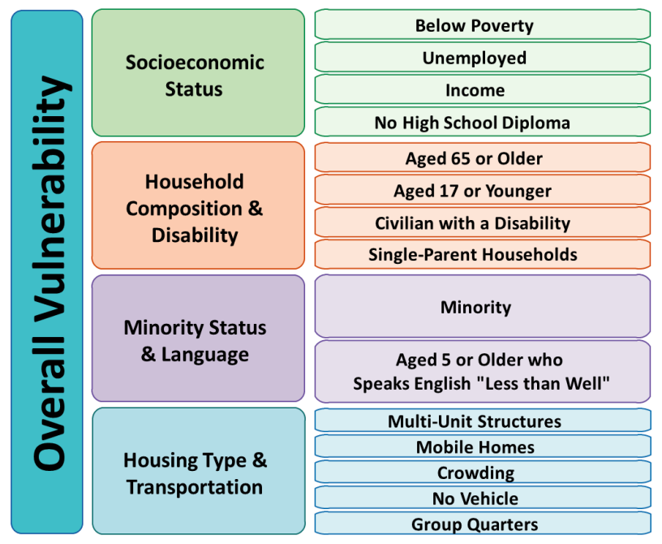
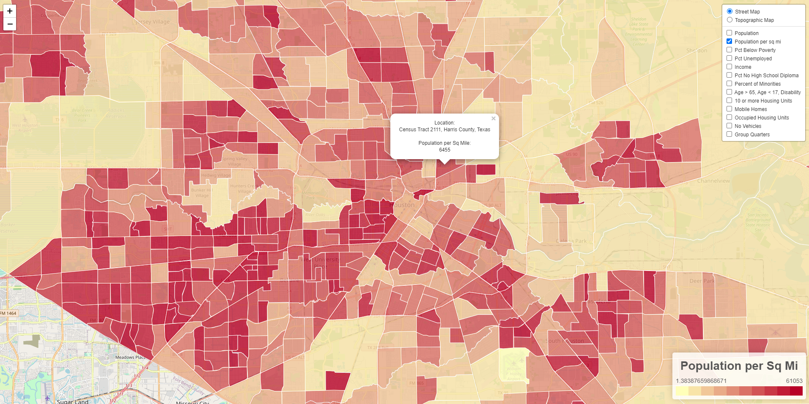
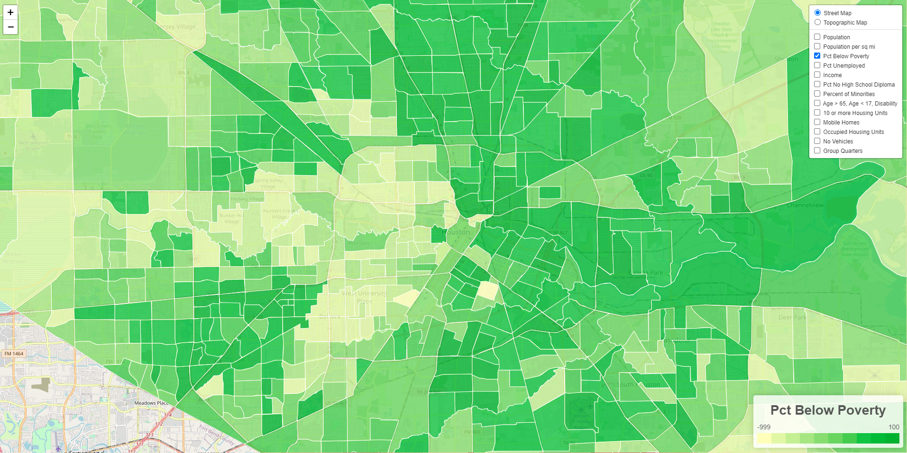
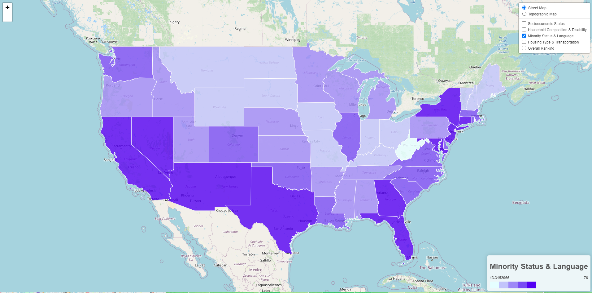
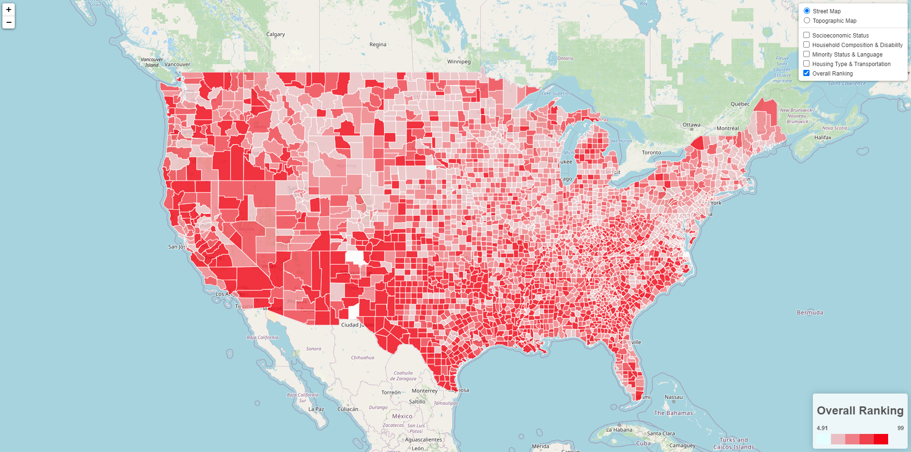

# Better Census Bureau Team

In this project, we take a look at the Social Vulnerability index for Houston and how it relates to national data.  

The social vulnerability index is made of 15 different factors with 4 categories including Socioeconomic Status, Household Composition & Disability, Minority Status & Language, Housing Type & Transportation.  

We chart these various metrics using GeoJSON data combined with census data and show them using an HTML and JavaScript front end.  

Data sources are listed below:  

[City of Houston Data Map](https://mycity.houstontx.gov/myrsvi/cohSVImapping.html)

[Agency for Toxic Substances and Disease Registry](https://www.atsdr.cdc.gov/placeandhealth/svi/data_documentation_download.html)

